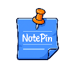
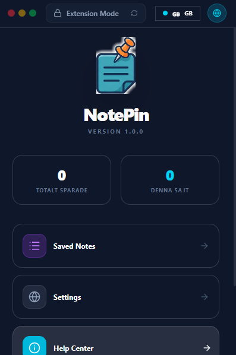
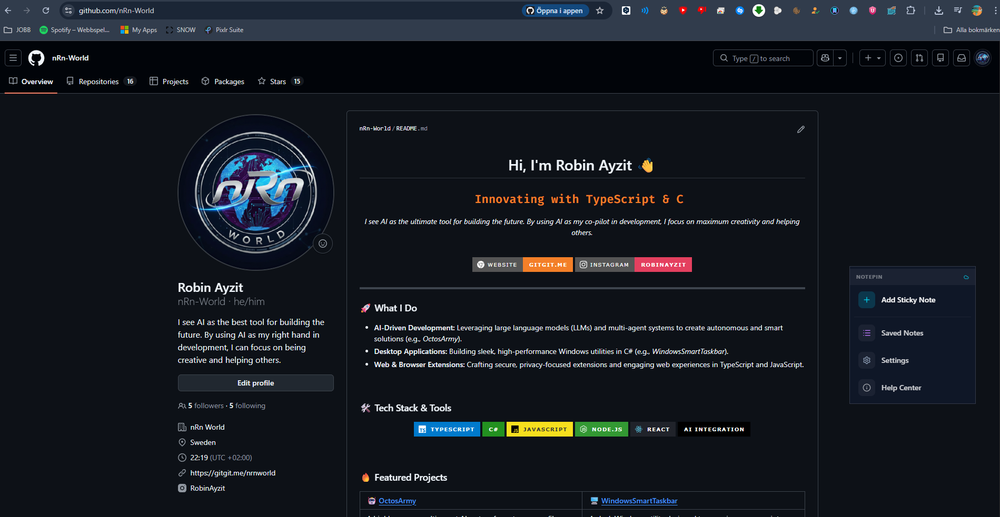
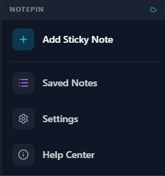
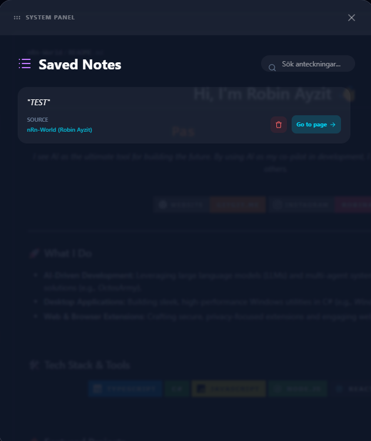

<p align="center">
  
</p>

<h1 align="center">NotePin</h1>

<p align="center">
  <strong>Effortless, contextual, and persistent note-taking for the web.</strong>
  <br />
  A premium Chrome Extension to pin floating notes directly to any element on any webpage.
</p>

<p align="center">
  
  
  
</p>

---

## ✨ Features

- 📌 **Smart Anchoring:** Pin notes to specific DOM elements. They follow the scroll and stay where you put them.
- 🕒 **Hold to Create:** Simple 1-second right-click hold to trigger the note creation menu without interfering with standard context menus.
- 🎨 **Premium UI:** Modern glassmorphism design with smooth animations and customizable note colors.
- 🌍 **Multi-language:** Full support for both **English** and **Swedish**.
- 📂 **Management Dashboard:** A central "All Notes" view to search, manage, and delete your notes across the web.
- ☁️ **Sync & Backup:** Choose between Local or Sync storage and export/import your data anytime.

---

## 📸 Screenshots

<p align="center">
  
  
</p>
<p align="center">
  
  
</p>

---

## 🛠️ Installation

### For Users
1. Download the latest release from the [Chrome Web Store](https://chrome.google.com/webstore).
2. Click **Add to Chrome**.
3. Start pinning notes!

### For Developers
1. Clone the repository:
   ```bash
   git clone https://github.com/nRn-World/NotePin.git
   ```
2. Navigate to the project folder:
   ```bash
   cd notepin
   ```
3. Install dependencies:
   ```bash
   npm install
   ```
4. Run in development mode:
   ```bash
   npm run dev
   ```
5. Build for production:
   ```bash
   npm run build
   ```

---

## 🔒 Privacy

NotePin is built with privacy in mind. Your notes stay on your device or in your personal Google Sync account. No data is ever transmitted to external servers.

---

## 📩 Contact & Support

**NotePin** was created by **Robin Ayzit** (nRn World).

- 📧 Email: [bynrnworld@gmail.com](mailto:bynrnworld@gmail.com)
- 🌐 Website: [nRn World](https://github.com/nRn-World)

---

<p align="center">
  Created with ❤️ by nRn World © 2026
</p>
