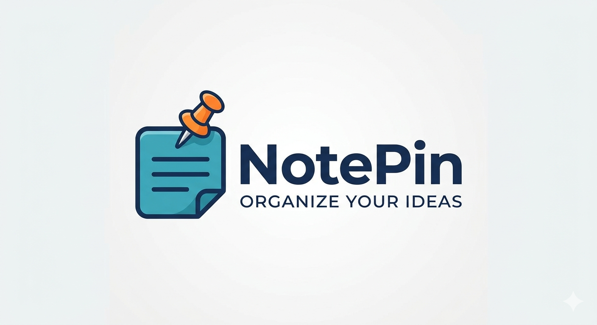
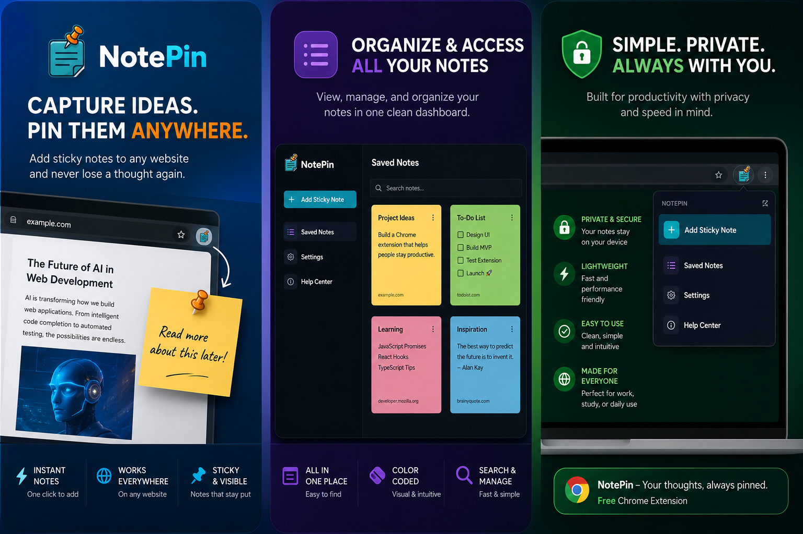
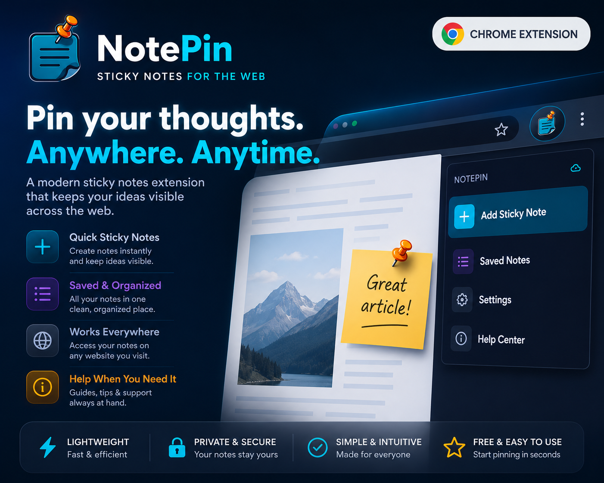
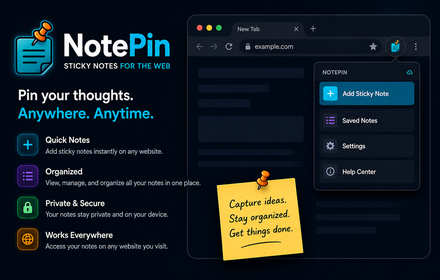

<p align="center">
  
</p>

<h1 align="center">NotePin</h1>

<p align="center">
  <strong>Pin sticky notes directly onto any webpage — right where you need them.</strong>
  <br />
  A premium, privacy-first Chrome &amp; Firefox extension for contextual, persistent, floating notes.
</p>

<p align="center">
  <a href="https://chromewebstore.google.com/detail/notepin/fbodkflennhdbmabddjjmpfccpdghlmo">
    
  </a>
  
  
  
</p>

---

## 📌 About

> *"Post-its, but for the web."*

NotePin lets you pin floating sticky notes directly onto any webpage — anchored exactly where they matter. Hold right-click for 1 second on any element, add your note, and it stays there. Close the tab, come back later, and your note is waiting.

Everything runs **100% locally**. Your notes never leave your device unless *you* enable Chrome Sync. No accounts. No tracking. No telemetry.

- **🏷️ Tags:** `chrome-extension` · `firefox-addon` · `notes` · `sticky-notes` · `productivity` · `annotation` · `privacy-first` · `offline-first`
- **🌐 Homepage:** https://nrnworld.one/p/notepin
- **🛡️ Privacy Policy:** https://nrnworld.one/NotePin/privacy.html

---

## ✨ Features

<table>
  <tr>
    <td width="33%" valign="top">

### 🖱️ 1-second Hold
Hold right-click anywhere on a page for **1 second** and NotePin's menu appears — no conflict with the normal context menu.

    </td>
    <td width="33%" valign="top">

### 📍 Contextual Pinning
Notes tie to the exact URL you create them on. Open the page later and they pop up right where you left them.

    </td>
    <td width="33%" valign="top">

### 🎨 Premium UI
Glassmorphism design, 5 vibrant accent colors, micro-animations, minimise, resize and layer controls.

    </td>
  </tr>
  <tr>
    <td valign="top">

### 💾 Auto-Save
Every keystroke is saved the instant you type it. Never lose a thought.

    </td>
    <td valign="top">

### 📚 Saved Notes Dashboard
Search, filter, delete and **jump to the source page** of any note from a single popup dashboard.

    </td>
    <td valign="top">

### ☁️ Local or Sync
Keep everything strictly offline on your machine, or opt-in to Chrome Sync to carry notes across devices.

    </td>
  </tr>
  <tr>
    <td valign="top">

### 📦 Export / Import
One-click JSON backup & restore — your data is always portable.

    </td>
    <td valign="top">

### 🌍 Multi-Language
Full UI in **English**, **Svenska**, **Español**, and **Français**.

    </td>
    <td valign="top">

### 🔒 Truly Private
Zero network calls. Zero analytics. Zero server round-trips. Read the code and see for yourself.

    </td>
  </tr>
</table>

---

## 📸 Screenshots

<p align="center">
  
  
</p>
<p align="center">
  
  
</p>

---

## 🚀 Install

### Chrome / Edge / Brave (Chromium)
👉 **[Install from Chrome Web Store](https://chromewebstore.google.com/detail/notepin/fbodkflennhdbmabddjjmpfccpdghlmo)**

### Firefox
👉 Available on AMO (addons.mozilla.org) — search **NotePin** or use the source zip in this repo.

### Load Unpacked (Local Testing)
1. Download this repo and open a terminal in `notepin/`
2. Install & build:
   ```bash
   npm install
   npm run build
   ```
3. Open `chrome://extensions` → enable **Developer mode** → **Load unpacked**
4. Select the `notepin/dist` folder

---

## 🛠️ How to Use

1. **Create a note** → On any webpage, **hold right-click for 1 second** → click *Add Sticky Note*
2. **Type instantly** → Click inside the note and start writing. Everything auto-saves.
3. **Move / resize** → Drag the top handlebar to move. Drag the bottom-right corner to resize.
4. **Bring to front** → Click any note to layer it above others.
5. **Minimize / delete** → Use the icon buttons in the top-right of each note.
6. **Find notes later** → Click the NotePin extension icon → **Saved Notes** → search → *Go to page* to jump back.

---

## 🧠 Tech Stack

| Layer | Tech |
|---|---|
| Framework | **React 19** + **TypeScript** |
| Build | **Vite 6** |
| Styling | **Tailwind CSS 4** + custom glassmorphism |
| Animations | **Motion** (Framer) |
| Icons | **lucide-react** |
| Storage | `chrome.storage.local` / `chrome.storage.sync` |
| Manifest | **MV3** (Chrome) + Gecko-compatible (Firefox) |

```
NotePin/
├── notepin/
│   ├── public/             # manifest.json, icons, _locales, loader.js
│   ├── src/
│   │   ├── components/     # Note.tsx, ContextMenu.tsx
│   │   ├── App.tsx         # Main UI, state, storage sync
│   │   ├── content.tsx     # Shadow DOM bootstrap + hold-to-open logic
│   │   └── background.ts   # Service worker
│   └── package.json
└── NotePin_v1.0.6.zip      # Built & ready for Chrome Web Store
```

---

## 🧾 Changelog

### v1.0.6 — *October 2026*
- 🐛 **FIXED** Notes created on a web page no longer "leak" and render inside the popup window — they only show up under **Saved Notes**, exactly as expected.
- 🔄 **FIXED** Saved Notes dashboard now reliably refreshes from storage every time you open it, and live-syncs across all open tabs via `chrome.storage.onChanged`.
- 🎯 **FIXED** Drag-and-drop now works smoothly on every note — brand-new or previously created. Replaced the built-in Motion.js drag handler with a custom capture-phase implementation that correctly uses page-absolute coordinates and never interrupts mid-drag when React re-renders.
- 🏷️ Unified version numbers across `manifest.json`, `package.json`, and UI chips (v1.0.6 everywhere).
- 📱 Added `es`, `fr` locales.
- 🖼️ New screenshots, logos, promo banner, Firefox release zips included in the repo.

### v1.0.5
- Initial public release.
- Hold-to-create, Saved Notes dashboard, Export/Import, English + Swedish.

---

## 🔒 Privacy

> *Your notes. Your device. Your rules.*

NotePin is built so that:

- ✅ **No data ever leaves your device** unless you explicitly enable Chrome Sync (which is handled entirely by Google's encrypted sync pipeline — we see nothing).
- ✅ **Zero network requests** from the extension to any server.
- ✅ **Zero analytics, zero telemetry, zero cookies.**
- ✅ Read the audit yourself — every line is in this repository.

Full privacy policy → **https://nrnworld.one/NotePin/privacy.html**

---

## 💜 Support the Project

If NotePin saves you time every day, consider supporting an independent developer. Every coffee fuels late nights polishing the UI, squashing bugs, and keeping the extension free & ad-free forever.

<p align="center">
  <a href="https://www.buymeacoffee.com/nrnworld">
    
  </a>
  <a href="https://ko-fi.com/nrnworld">
    
  </a>
</p>

---

## 📬 Contact & Links

| Channel | Link |
|---|---|
| 📧 Email | `bynrnworld@gmail.com` |
| 🌐 Website | https://nrnworld.one |
| 💻 GitHub | https://github.com/nRn-World |
| 🐙 NotePin Repo | https://github.com/nRn-World/NotePin |

<p align="center">
  <a href="https://star-history.com/#nRn-World/NotePin&Date">
    ⭐ Star this repo if you found NotePin useful — it really helps!
  </a>
  <br><br>
  Created with ❤️ & lots of ☕ by <strong>Robin Ayzit · nRn World © 2026</strong>
  <br>
  Licensed under <a href="LICENSE.md">CC BY-NC 4.0</a>.
</p>
